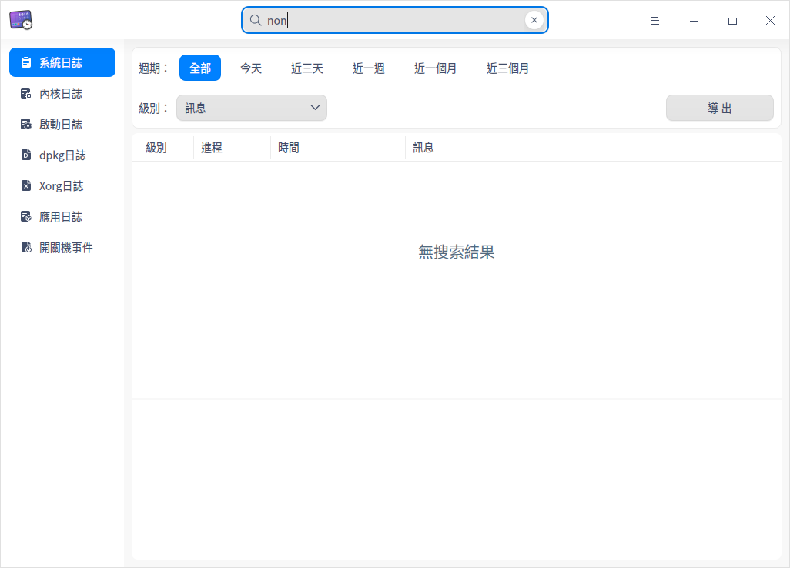
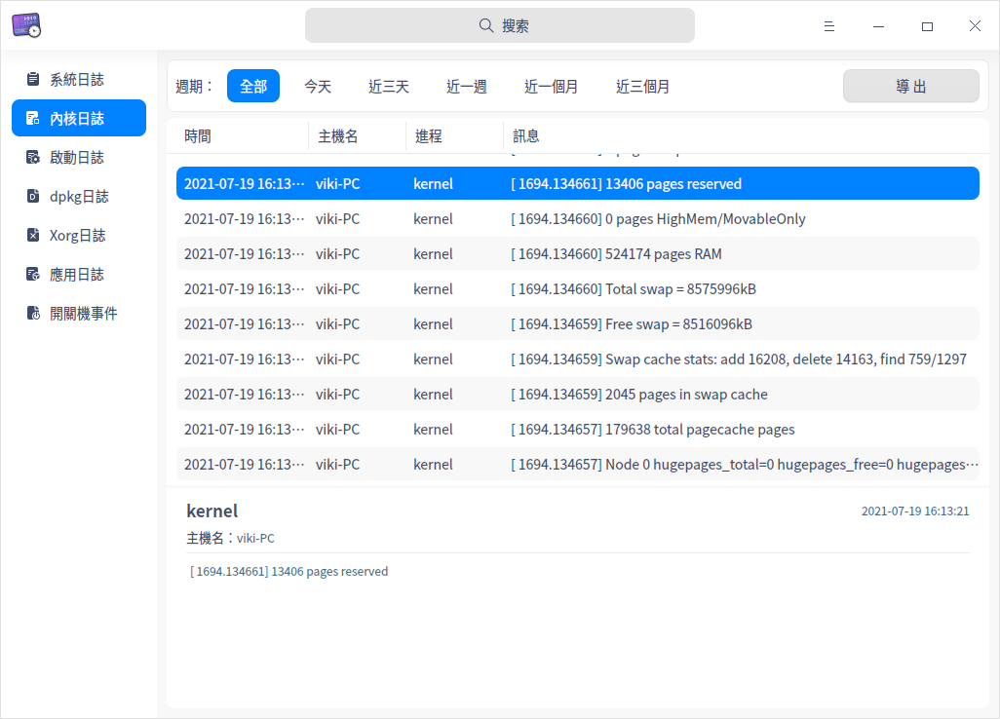
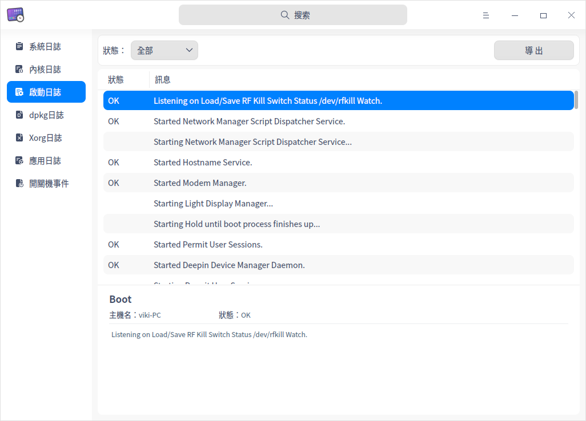
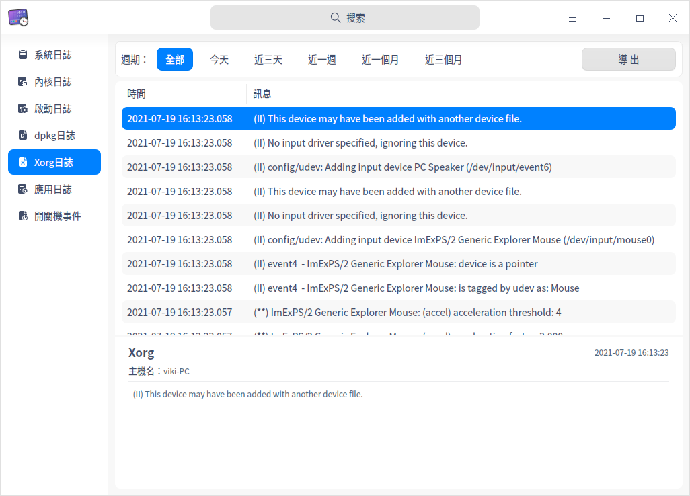
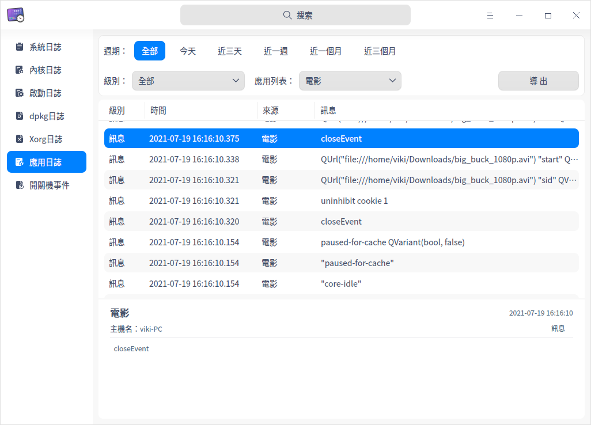
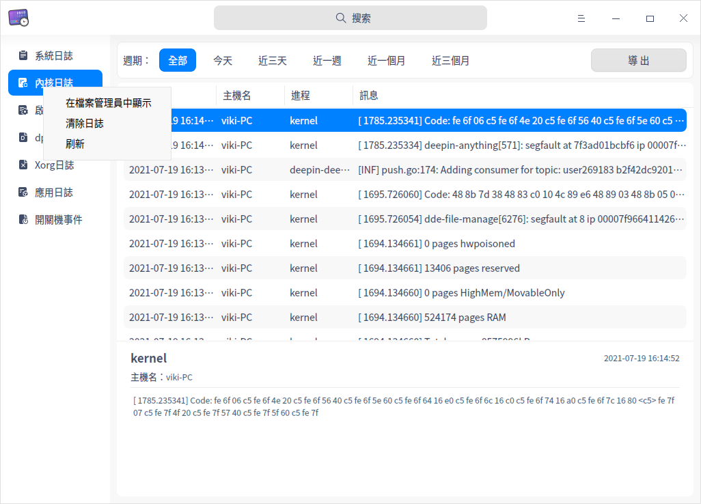

# 日誌查看器|deepin-log-viewer|

## 概述

日誌查看器是負責收集程序運行時所產生日誌的小工具，如操作系統和應用程序在啟動、運行等過程中的相關訊息。您可以通過分析詳細日誌訊息，快速的找到故障原因並解決問題。

## 使用入門

您可以通過以下方式運行或關閉日誌查看器，或者創建快捷方式。

### 運行日誌查看器

1. 單擊任務欄上的啟動器圖標 ，進入啟動器界面。
2. 上下滾動鼠標滾輪瀏覽或通過搜索，找到日誌查看器圖標 ，單擊運行。
3. 右鍵單擊 ，您可以：
   - 單擊 **傳送到桌面**，在桌面創建快捷方式。
   - 單擊 **傳送到任務欄**，將應用程序固定到任務欄。
   - 單擊 **加至開機啟動**，將應用程序添加到開機啟動項，在電腦開機時自動運行該應用程序。

### 關閉日誌查看器

- 在日誌查看器界面，單擊 ，退出日誌查看器。
- 在任務欄上單擊 ，選擇 **關閉所有**，退出日誌查看器。
- 在日誌查看器界面單擊 ，選擇 **退出**，退出日誌查看器。

## 操作介紹

### 搜索日志

1. 在日誌查看器搜索框中，單擊 。
2. 輸入關鍵字，實時顯示搜索結果。

### 篩選日志

您可以通過 **週期**、**級別**、**狀態**、**應用列表** 或 **事件類型** 來篩選日誌。
<table border="1">
   <tr>
    <th>類型</th>
 <th>說明 </th>
</tr>
   <tr>
    <td>按週期篩選</td>
    <td>按日誌生成的時間順序進行篩選。
      <ul>
          <li>選項包括：全部、今天、近三天、近一週、近一個月、近三個月，默認選項為全部。</li>
          <li>適用類型：除了啟動日誌沒有顯示時間外，其他類型的日誌都支持按週期篩選。</li>
      </ul>
 </td>
</tr>
   <tr>
    <td>按級別篩選</td>
    <td>按照事件的級別高低進行篩選。
    <ul>
          <li>選項包括：全部、緊急、嚴重警告、嚴重、錯誤、警告、注意、訊息、調試，默認選項為訊息。</li>
          <li>適用類型：系統日誌、應用日誌。</li>
      </ul>
      <tr>
    <td>按狀態篩選</td>
    <td>
    <ul>
          <li>選項包括：全部、OK、Failed，默認選項為全部。</li>
          <li>適用類型：僅適用於啟動日誌。</li>
      </ul>
          <tr>
    <td>按應用列表篩選</td>
    <td>
        適用類型：僅適用於應用日誌，對應用程序的log文件進行篩選，默認選項為第一個應用程序。 </td>
              <tr>
    <td>按事件類型篩選</td>
    <td>
    <ul>
          <li>選項包括：全部、登錄、開機、關機，默認選項為全部。</li>
          <li>適用類型：僅適用於開關機事件。</li>
      </ul>
 </td>
   </tr>
   </table>

### 查看日志

#### 系統日誌

1. 在日誌查看器界面，單擊 **系統日誌**。
2. 查看系統日誌的級別、進程、時間和訊息。
3. 選中某條日誌後，可查看該日誌的詳細訊息，包括日誌進程、主機名、進程號、級別、時間和詳細訊息。

#### 內核日誌

1. 在日誌查看器界面，單擊 **內核日誌**。
2. 在彈出的授權對話框中，輸入用戶密碼完成授權。
3. 查看內核日誌的時間、主機名、進程和訊息。
4. 選中某條日誌後，可查看該日誌的詳細訊息，包括進程、時間、主機名和詳細訊息。

#### 啟動日誌

1. 在日誌查看器界面，單擊 **啟動日誌**。
2. 在彈出的授權對話框中，輸入用戶密碼完成授權。
3. 查看啟動日誌的狀態和訊息。
4. 選中某條日誌後，可查看該日誌的詳細訊息，包括主機名、狀態和詳細訊息。

#### dpkg日誌

1. 在日誌查看器界面，單擊 **dpkg日誌**。
2. 查看dpkg日誌的時間和訊息。
3. 選中某條日誌後，可查看該日誌的詳細訊息，包括主機名、動作、時間和詳細訊息。

#### Xorg日誌

1. 在日誌查看器界面，單擊 **Xorg日誌**。
2. 查看Xorg日誌的時間和訊息。
3. 選中某條日誌後，可查看該日誌的詳細訊息，包括主機名、時間和詳細訊息。

#### 應用日誌

1. 在日誌查看器界面，單擊 **應用日誌**。
2. 查看應用日誌的級別、時間、來源和訊息。
3. 選中某條日誌後，可查看該日誌的詳細訊息，包括來源、主機名、時間、級別和詳細訊息。

#### 開關機事件

1. 在日誌查看器界面，單擊 **開關機事件**。
2. 查看開關機事件的事件類型、用戶名、時間和訊息。
3. 選中某條日誌後，可查看該日誌的詳細訊息，包括時間、主機名、事件類型、用戶名和詳細訊息。

### 導出日志

您可以將當前日誌導出為文件進行保存，支持導出的文件格式為txt/doc/xls/html。

1. 在日誌查看器界面，選擇某一日誌類型，單擊 **導出**。
2. 在彈出的窗口中選擇存儲路徑，設置文件名稱和格式。
3. 單擊 **保存**，成功導出日誌後，界面下方會彈出提示訊息。

### 刷新日誌

1. 在日誌查看器左側導航欄中，右鍵單擊某一日誌類型。
2. 選擇 **刷新**，重新加載該日誌文件，更新日誌列表。

### 在檔案管理員中顯示
在日誌查看器中僅內核日誌、啟動日誌、dpkg日誌、Xorg日誌和應用日誌支持 **在檔案管理員中顯示** 的功能。

1. 在日誌查看器左側導航欄中，右鍵單擊某一日誌類型。
2. 選擇 **在檔案管理員中顯示**，定位到當前日誌的存儲位置。

### 清除日誌
在日誌查看器中僅內核日誌、啟動日誌、dpkg日誌、Xorg日誌和應用日誌支持 **清除日誌** 的功能。
1. 在日誌查看器左側導航欄中，右鍵單擊某一日誌類型。
2. 選擇 **清除日誌**，在彈出的對話框中單擊確定按鈕，清除當前的日誌內容。
3. 如果彈出認證窗口，請輸入密碼完成認證，即可完成操作。

## 主菜單

在主菜單中，您可以進行切換窗口主題，查看幫助手冊等操作。

### 主題

窗口主題包含淺色主題、深色主題和系統主題。

1. 在日誌查看器界面，單擊 。
2. 選擇 **主題**，選擇一個主題顏色。

### 幫助

查看幫助手冊，進一步了解和使用日誌查看器。

1. 在日誌查看器界面，單擊 。
2. 選擇 **幫助**。
3. 查看日誌查看器的幫助手冊。

### 關於

1. 在日誌查看器界面，單擊 。
2. 選擇 **關於**。
3. 查看日誌查看器的版本和介紹。

### 退出

1. 在日誌查看器界面，單擊 。
2. 選擇 **退出**。

